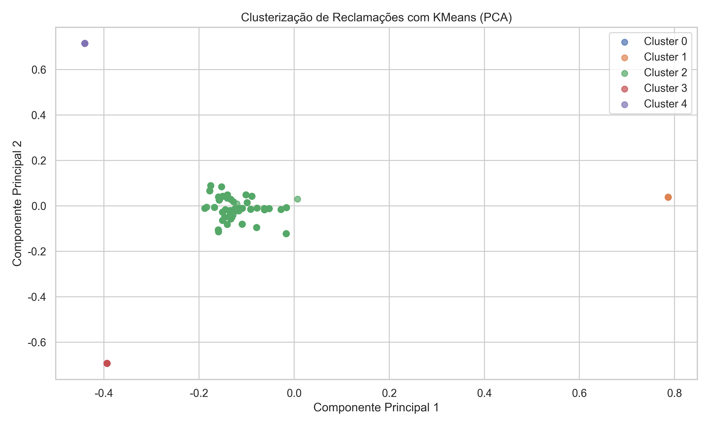
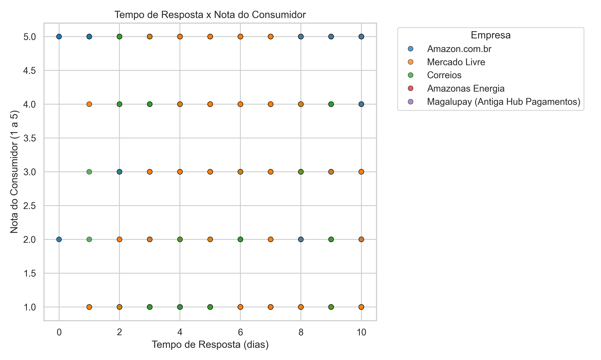
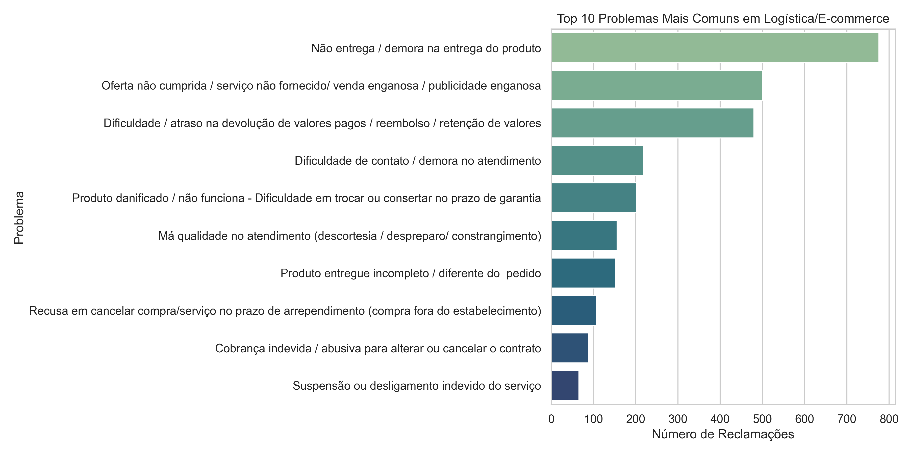
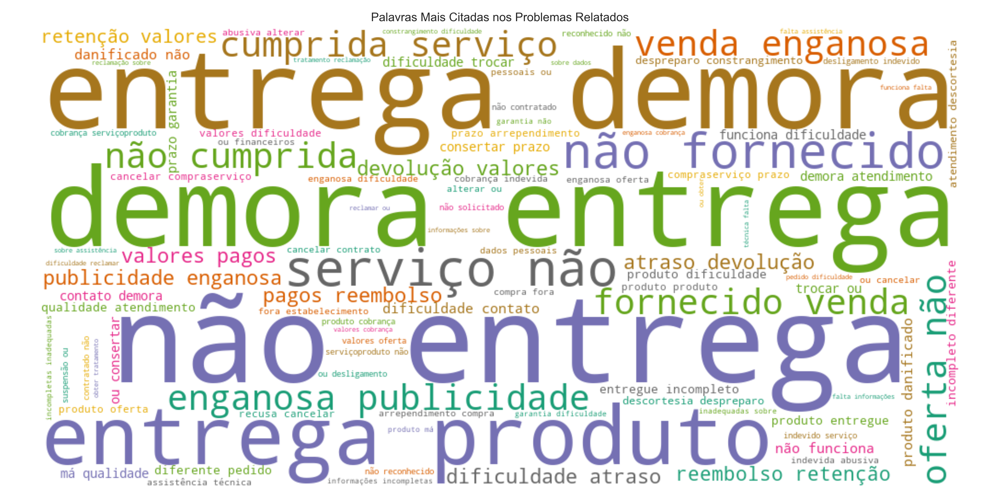

# 📊 Pipeline de Análise de Reclamações Públicas – Logística & E-commerce (Mar/2025)


Projeto de análise de dados públicos focado no setor de Logística e E-commerce, utilizando técnicas de Machine Learning, NLP e Visualização de Dados para extrair insights estratégicos a partir de reclamações de consumidores.

O objetivo é construir um pipeline robusto que percorre todas as etapas de um projeto real: desde o pré-processamento dos dados, análise exploratória, clusterização de problemas, classificação supervisionada, até a geração de relatórios automáticos e insights estratégicos para tomada de decisão.

---

## 📂 Estrutura de Pastas

```
Pipeline_Reclamacoes_Publicas_2025/
├── dados/               # Bases de dados de entrada
│   └─ base_completa_2025-03.csv
├── outputs/             # Gráficos gerados e relatório final
│   ├─ clusters_kmeans.png
│   ├─ nota_vs_resposta.png
│   ├─ relatorio_final_abnt.pdf
│   ├─ top_problemas.png
│   └─ wordcloud_problemas.png
├── src/                 # Código fonte do projeto
│   └─ Pipeline_reclamacoes_publicas_mar_2025.py
├── requirements.txt     # Bibliotecas necessárias
└── README.md             # Descrição e documentação do projeto
```

---

## 🚀 Tecnologias Utilizadas

- Python 3.12
- Pandas
- NumPy
- Matplotlib
- Seaborn
- Scikit-learn
- WordCloud
- FPDF (geração de relatórios PDF)

---

## 🔎 Etapas do Projeto

- **Leitura e pré-processamento**: limpeza e padronização da base de dados pública
- **Filtragem estratégica**: foco nas empresas de logística e e-commerce
- **Análise exploratória**: identificação dos principais problemas reportados
- **Visualização de dados**: geração de gráficos e WordCloud
- **Clusterização**: agrupamento de reclamações com KMeans + redução dimensional PCA
- **Classificação supervisionada**: predição de clusters com Regressão Logística
- **Geração de relatórios**: produção automática de relatório completo em formato ABNT

---

## 🗂️ Sobre a Base de Dados

Os dados foram obtidos de fontes públicas de reclamações de consumidores, relacionados a diversos setores do mercado brasileiro.
Para este projeto, foi aplicado um filtro para focar nos segmentos de **Logística** e **E-commerce**, abrangendo empresas de entregas, marketplaces e serviços digitais correlatos.

As principais etapas de preparação incluíram:

- Correção de encoding de texto
- Normalização de nomes de colunas
- Remoção de inconsistências e duplicidades
- Criação de novas variáveis para suporte analítico

Fonte original dos dados:  
**Plataforma Consumidor.gov.br – Dados Abertos**

---

## ⚙️ Como Rodar o Projeto

1. Clone o repositório:

```bash
git clone https://github.com/MarcosScatolinoBR/Pipeline_Reclamacoes_Publicas_2025.git
```

2. Instale as dependências necessárias:

```bash
pip install -r requirements.txt
```

3. Execute o pipeline principal:

```bash
python src/Pipeline_reclamacoes_publicas_mar_2025.py
```

4. Os gráficos e o relatório serão gerados na pasta `outputs/`.

---

## 📊 Exemplos de Saída

### 🎯 Clusterização dos Problemas


### 🎯 Relação entre Tempo de Resposta e Nota do Consumidor


### 🎯 Reclamações Mais Frequentes


### 🎯 WordCloud dos Principais Problemas


---

## 👨‍💻 Autor

Projeto desenvolvido por **Marcos Scatolino** — 2025.

---

## 📞 Contato

- **Email**: marcosscatolino@gmail.com
- **LinkedIn**: [Marcos Scatolino](https://www.linkedin.com/in/marcos-scatolino)

---
